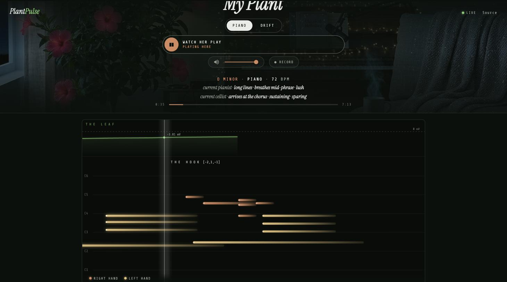

# PlantPulse

**Your plant is making music right now. You just can't hear it yet.**

PlantPulse reads the bioelectrical signal of a living plant through two alligator clips on a leaf and turns it into music, live, in your browser. Not a voltage-to-pitch mapper: a composer that hears the plant as four signals ranked against its own day and plays from them. Two rooms, a drone and a piano. About $15 of hardware, no cloud, nothing leaves your network.



**[Listen live](https://plantpulse.hook.technology)**: a hibiscus performs around the clock. That site runs the project's SuperCollider engine; this repository is the free browser port of the same musical decisions, for your own plant. (The old Tone.js preset engine this repo once held is [release v1.0.0](https://github.com/hook-365/plantpulse-tonejs/releases/tag/v1.0.0).)

## What you're hearing

Plants produce microvolt-level electrical fluctuations across their leaves: ion transport, light response, touch, temperature, and processes nobody fully understands. PlantPulse reads them at 16-bit resolution and hears them as:

- **energy**, how lively the plant is, as a **rank against its own trailing day**, so a quiet plant and a lively plant both get a full range, and the median is 0.5 by construction;
- **stability**, how settled the recent signal is;
- **center**, where the signal sits in its ten-minute range;
- **tilt**, which way it is heading;
- **weather**, the day's character: this hour ranked against the day's other hours.

A composer plays from those. The harmony is a walk over tonic, subdominant and dominant, with the plant leaning it home or away, chords coloured per dwell, voices led by nearest motion. Every song draws its players fresh, like a station that never books the same combo twice. Nothing is scripted and nothing is stored: every phrase is generated, remembered for the song, developed (never verbatim), and the song's hook is frozen from its own opening and stated again at the chorus.

### The rooms

- **drift**: a slow breathing drone. Held voices cross-fade through the harmony walk, a sub sits under the root, and the plant's energy opens the timbre while the chord rings; centre and tilt sweep its vowel. Seamless across songs. It needs no samples: something to sleep to.
- **piano**: a pianist drawn every song (touch, rhythm feel, register, how they develop an idea, the left-hand figure) with two hands on a sampled grand, and about half the time a cellist who holds an inner voice, answers the piano's phrases, and may sing one section of the song. Verses, choruses, breakdowns; a real ritardando at the double bar.

The full decision surface, every choice with its plant input and its randomness, is in [`docs/COMPOSER.md`](docs/COMPOSER.md).

## The signal chain

```
Plant leaf ──→ Alligator clips ──→ ADS1115 16-bit ADC (±256 mV, 4 samples/sec)
                                        │ I2C
                                   ESP32-WROOM-32D
                                        │ WiFi + MQTT
                                   Mosquitto broker
                                        │
                                   Flask server (MQTT → SSE, serves the page and your samples)
                                        │ Server-Sent Events
                                   Browser: the composer, plain Web Audio
```

**Dumb sensor, secure server, smart client.** The ESP32 publishes raw volts and nothing else. The server holds the broker credentials and relays the readings. Every musical decision, and every note, happens in your browser. The page makes no third-party requests.

## Hardware

| Part | Description | Cost |
|------|-------------|------|
| ESP32-WROOM-32D | WiFi microcontroller | ~$5 |
| ADS1115 | 16-bit I2C ADC with PGA | ~$3 |
| Soft alligator clips | Electrode clips for leaves | ~$2 |
| Breadboard + jumpers | Prototyping | ~$5 |

```
ADS1115          ESP32
───────          ─────
VDD ──────────── 3.3V
GND ──────────── GND
SCL ──────────── GPIO 22
SDA ──────────── GPIO 21
ADDR ─────────── GND (I2C address 0x48)
A0 ───────────── Alligator clip 1 (leaf)
A1 ───────────── Alligator clip 2 (leaf)
```

The ADS1115 reads the differential voltage between the two clips at ±256 mV gain, sensitive enough for the plant's microvolt signals. A second chip is optional (a commented block in `plantpulse.yaml`); the composer listens to the first pair.

## Software setup

You need [ESPHome](https://esphome.io/) to flash the ESP32, Docker for the server, and `ffmpeg` on the host if you want the piano room's samples.

### 1. Flash the ESP32

```bash
cp secrets.yaml.example secrets.yaml   # WiFi, OTA password, the broker's address and credentials
esphome run plantpulse.yaml
```

### 2. Run the server

```bash
cp .env.example .env                   # MQTT_HOST / MQTT_USER / MQTT_PASS
docker compose up -d                   # with a broker you already run (MQTT_HOST in .env), or:
tools/broker-password                  # writes the bundled broker's password file from .env
docker compose --profile broker up -d  # ...and runs it: the ESP32 connects to this machine on 1883
```

No plant yet? `docker compose --profile demo up` runs a fake plant on the bundled broker so you can hear the rooms.

### 3. The piano room's samples

The **drift** room plays with nothing to download. The **piano** room needs two free libraries that are fetched from their publishers rather than shipped here:

- **Salamander Grand Piano V3** by Alexander Holm, CC BY 3.0
- **Philharmonia Orchestra cello**, free for any use, whose terms say the samples must not be made available "as is": so they never appear in this repository

```bash
tools/fetch-samples            # ~580 MB download into ./samples (needs ffmpeg); --hifi for the 48 kHz master
```

It builds the three web packs the page reads (`samples/web/`), which `docker compose` mounts read-only; no restart needed. Re-run it safely any time. If you publish audio made with the piano room, credit Alexander Holm (CC BY 3.0) and the Philharmonia Orchestra; details in [`NOTICE.md`](NOTICE.md).

### 4. Open the page

`http://your-server:8286`. Pick a room, press play. The stage shrinks and the roll opens: the leaf's voltage above, the notes it chose below, on one clock, the notes sounding as they cross the line (the composer runs three seconds ahead of the sound, so you see each note coming). Above it: the key, the room, the tempo, the pianist's and cellist's words for this song, and the track's progress. The meters under the fold show the four signals and how far the ranks have warmed (they need two hours of the plant's day to leave the fixed ceiling, four to be fully its own; the page remembers the day across reloads). `record` saves what you hear as a `.webm`; `last take` saves the finished song's note log, the file `tools/take-review` grades.

Behind a reverse proxy, the stream needs buffering off:

```nginx
location /api/stream {
    proxy_pass http://localhost:8286;
    proxy_buffering off;
    proxy_cache off;
    proxy_read_timeout 86400;
    proxy_set_header X-Accel-Buffering no;
}
```

## Receipts

`tools/gate` is the whole verdict in one exit code: the mood schema closed against the data, every key read by its module and named in the contract, the raw plant features confined to the energy model, no third-party requests from the page, and `node --test` over a virtual day (the composer with a synthetic plant and a fake audio layer: energy's median lands at 0.5 after a day, the walk stays diatonic, drift never fires a piano note, the piano stays in its window, the cellist appears about half the time). `tools/take-review energy | harmony | melody | cello` prints the live project's review numbers from the page's own takes.

## How this relates to the main project

The live site is a private build: the same composer in SuperCollider, three rooms (the third, lofi, uses licensed drum kits and sample packs and stays stream-only), Icecast streams, cast, recordings with posters, accounts. This repository is the browser port of the drift and piano rooms, kept in step with the composer's decision spec, free to run on your own plant. The composer's data (`static/composer/`) is copied from the live project by `tools/sync-composer-data`.

## License

MIT (see `LICENSE`). Third-party notices and the sample credits in `NOTICE.md`. Built by [Anthony Hook](https://github.com/hook-365).
