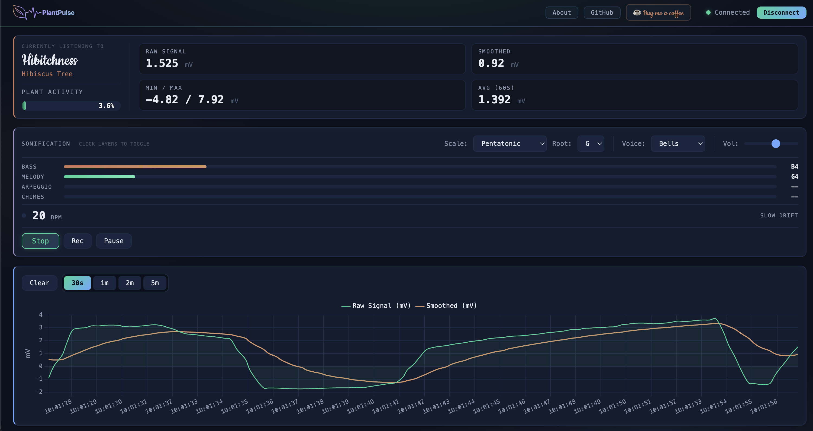

# 🌿 PlantPulse

A DIY plant bioelectrical sonification system — listen to your plants make music in real-time.

PlantPulse reads microvolt-level bioelectrical signals from plant leaves using an ADS1115 16-bit ADC, streams the data via MQTT, and maps the signal to generative ambient music in the browser using the Web Audio API.



**[Live Demo](https://plantpulse.hook.technology)** — listen to a hibiscus tree make music in real-time

## How It Works

```
Plant leaf → Alligator clips → ADS1115 (16-bit ADC, ±256mV)
                                    ↓ I2C
                               ESP32-WROOM-32D → MQTT → Mosquitto broker
                                                              ↓ WebSocket
                                                         Browser (Chart.js + Tone.js)
                                                              ↓
                                                           🎵 Music
```

1. **Bioelectrical signal capture**: Soft alligator clips attach to a plant leaf, picking up microvolt-level electrical fluctuations
2. **Signal digitization**: The ADS1115 reads the differential voltage between the two clips at 4 samples/sec with 16-bit resolution and programmable gain (±256mV range)
3. **Data streaming**: The ESP32 publishes raw voltage readings over MQTT — minimal processing on the microcontroller for maximum stability
4. **Visualization & sonification**: A browser-based dashboard displays real-time signal graphs and maps the plant's electrical activity to musical notes using pentatonic, minor, dorian, and other scales

## Hardware

### Components

| Part | Description | Approx Cost |
|------|-------------|-------------|
| ESP32-WROOM-32D | WiFi microcontroller | ~$5 |
| ADS1115 | 16-bit I2C ADC with PGA | ~$3 |
| Soft alligator clips | Electrode clips for plant leaves | ~$2 |
| Breadboard + jumper wires | For prototyping | ~$5 |

**Total: ~$15**

### Wiring

```
ADS1115          ESP32-WROOM-32D
───────          ───────────────
VDD ──────────── 3.3V
GND ──────────── GND
SCL ──────────── GPIO 22
SDA ──────────── GPIO 21
ADDR ─────────── GND (sets I2C address to 0x48)

A0 ───────────── Alligator clip 1 (plant electrode)
A1 ───────────── Alligator clip 2 (plant electrode)
```

> **Important**: Use GPIO numbers, not the "D" labels printed on some dev boards — they may not match! The I2C scan on boot will show `Found no devices` if SDA/SCL are swapped or connected to wrong pins.

## Software Setup

### Prerequisites

- [ESPHome](https://esphome.io/) (for flashing the ESP32)
- An MQTT broker (e.g., [Mosquitto](https://mosquitto.org/)) with WebSocket support enabled
- A web server to serve `index.html` (nginx, python3 http.server, etc.)

### 1. Flash the ESP32

1. Copy `secrets.yaml.example` to `secrets.yaml` and fill in your WiFi and MQTT credentials:

```bash
cp secrets.yaml.example secrets.yaml
# Edit secrets.yaml with your values
```

2. Update `plantpulse.yaml` with your MQTT broker IP address

3. Flash via ESPHome:

```bash
esphome run plantpulse.yaml
```

### 2. Configure MQTT Broker

Ensure your Mosquitto broker has WebSocket support enabled. Add to `mosquitto.conf`:

```
listener 1883
listener 9001
protocol websockets
```

Create credentials for the `plantpulse` user:

```bash
mosquitto_passwd -c /mosquitto/config/passwords plantpulse
```

### 3. Deploy the Dashboard

#### Option A: Simple local server

```bash
python3 -m http.server 8286
# Open http://localhost:8286
```

#### Option B: Docker (production)

```bash
docker compose up -d
# Serves on port 8286
```

#### Option C: Reverse proxy (public access)

If using a reverse proxy (nginx, NPM, Caddy), add a WebSocket proxy for `/mqtt`:

```nginx
location /mqtt {
    proxy_pass http://YOUR_BROKER_IP:9001;
    proxy_http_version 1.1;
    proxy_set_header Upgrade $http_upgrade;
    proxy_set_header Connection "upgrade";
    proxy_read_timeout 86400;
}
```

### 4. Configure the Dashboard

Edit the `PLANTPULSE_CONFIG` block at the top of the `<script>` section in `index.html`:

```javascript
const PLANTPULSE_CONFIG = {
  mqttBrokerLAN: 'ws://YOUR_BROKER_IP:9001',
  mqttUsername: 'plantpulse',
  mqttPassword: 'your-mqtt-password',
  mqttTopic: 'plantpulse/sensor/plant_signal/state',
};
```

## Features

### Real-Time Signal Visualization
- Raw and smoothed (EMA) signal traces
- Auto-scaling chart with 30s / 1m / 2m / 5m time windows
- Min/max range and 60-second rolling average
- Plant activity level indicator (rate of signal change)

### Generative Music Sonification
- **Scales**: Pentatonic, Natural Minor, Dorian, Mixolydian, Chromatic
- **Root notes**: All 12 keys (C through B)
- **Voices**: Bells, Soft Pad, Crystal, Warm Pad
- Signal voltage maps to pitch (note selection across 3 octaves)
- Activity level controls note density and velocity
- Signal direction influences ascending/descending movement

### Signal Processing (all client-side)
- Exponential moving average smoothing (α = 0.1)
- Activity level based on windowed delta analysis
- Adaptive signal range calibration
- All heavy processing runs in the browser — the ESP32 only reads the ADC

## Architecture

The design philosophy is **dumb sensor, smart client**:

- The ESP32 does exactly one thing: read the ADS1115 and publish the raw voltage over MQTT
- All smoothing, activity calculation, visualization, and sonification happens in the browser
- This keeps the ESP32 stable (no WiFi choking from SSE or heavy web serving)
- MQTT is extremely lightweight — fire-and-forget publish with tiny payloads

## Troubleshooting

### I2C scan shows "Found no devices"
- Double-check SDA → GPIO21 and SCL → GPIO22 (not swapped)
- Verify ADS1115 ADDR pin is connected to GND
- Ensure ADS1115 VDD is connected to 3.3V (not 5V)

### ESP32 becomes unresponsive
- The web_server ESPHome component is too heavy for sustained streaming — use MQTT instead
- Keep `logger: level: WARN` (debug logging over WiFi causes lag)
- 250ms update interval is the sweet spot for WiFi stability

### Signal reads ~0mV with no plant
- This is correct! The noise floor is ±0.015 mV — essentially zero without a biological signal source

### Signal is noisy or erratic
- Ensure all grounds are tied together (common ground rail)
- Keep clip leads short to reduce antenna effects
- Try moving away from power supplies or monitors (EMI sources)

## License

MIT
